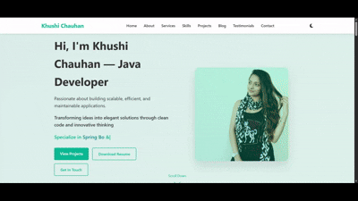

# 🎀 **Premium README – Khushi Chauhan Portfolio Website**

<p align="center">
  <b>Java Developer • Full-Stack Learner • Portfolio Website</b>
</p>

<p align="center">
  <a href="https://github.com/imkhushi01/Portfolio/stargazers">
    
  </a>
  <a href="https://github.com/imkhushi01/Portfolio/forks">
    
  </a>
  <a href="https://github.com/imkhushi01/Portfolio">
    
  </a>
  <a href="https://imkhushi01.github.io/Portfolio/">
    
  </a>
</p>

<p align="center">
  
  
  
  
  
</p>

---

# 🌐 **Website Preview**

<p align="center">
  
</p>

---

# 🌟 **Portfolio Website – Overview**

A modern, responsive, and beautifully animated portfolio website for **Khushi Chauhan (Java Developer)**.

This website highlights **projects, experience, skills, blogs, testimonials**, and helps potential employers and clients connect easily.

---

# 🚀 **Features**

* Fully Responsive Layout
* Dark/Light Mode (with LocalStorage)
* Smooth Scroll Animations (AOS)
* Typing Animation
* Animated Statistics
* Hover Effects
* Smart Navigation System
* SEO Friendly
* High Performance & Optimized

---

# 🛠️ **Technologies Used**

### **Frontend**

* HTML5
* CSS3
* JavaScript (ES6+)
* Font Awesome Icons

### **Libraries**

* AOS (Animate On Scroll)
* Google Fonts

### **Tools**

* Git
* VS Code
* Chrome DevTools

---

# 📁 **Project Structure**

```
Portfolio/
├── index.html
├── css/
│   └── style.css
├── js/
│   └── script.js
├── assets/
│   ├── images/
│   └── preview.gif        <-- Your GIF
├── README.md
└── .gitignore
```

---

# ⚙️ **Customization Guide**

### Branding (index.html)

```html
<h2>Your Name</h2>
```

### Hero Section

```html
<h1>Hi, I'm Your Name — Your Title</h1>
<p>Your professional tagline</p>
```

### Contact Details

```html
<span>Your Phone Number</span>
<span>your.email@example.com</span>
```

---

# 🎨 **Theme Customization (CSS)**

### Light Mode

```css
:root {
  --primary-color: #00a896;
  --secondary-color: #02c39a;
  --accent-color: #028090;
  --text-color: #333;
  --bg-color: #f5f5f5;
}
```

### Dark Mode

```css
body.dark-mode {
  --text-color: #e0e0e0;
  --bg-color: #121212;
  --card-bg: #1e1e1e;
}
```

---

# 🚀 **Deployment**

### 🔗 **Live Website**

👉 [https://imkhushi01.github.io/Portfolio/](https://imkhushi01.github.io/Portfolio/)

### GitHub Pages

* Push changes → Settings → Pages → Deploy from `main`

### Netlify / Vercel

* Import repository → Build & Deploy

---

# 📞 **Contact**

**Khushi Chauhan**

* Email: [chauhankhushi694@gmail.com](mailto:chauhankhushi694@gmail.com)
* LinkedIn: [https://linkedin.com/in/khushi-chauhan](https://linkedin.com/in/khushi-chauhan)
* GitHub: [https://github.com/imkhushi01](https://github.com/imkhushi01)
* Phone: +91 1234567890

---

# 🙏 **Thank You!**

If you like this portfolio,
⭐ **Please consider starring the repository!**
👉 [https://github.com/imkhushi01/Portfolio](https://github.com/imkhushi01/Portfolio)

---
